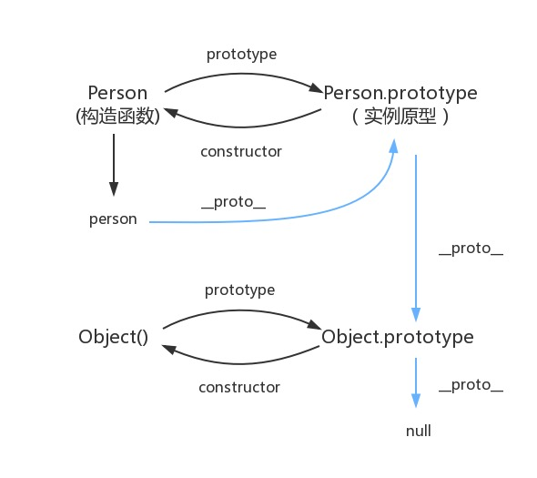

## 题目

* 如何精准判断一个变量是不是数组？

> `arr instanceof Array`
---

* class的原型本质， 怎么理解？
  

---

* 手写一个简易的jQuery， 考虑插件和扩展性

```javascript
// 使用class
class JQuery {
    constructor(selector) {
        const result = document.querySelectorAll(selector)
        const length = result.length
        for (let i = 0; i < length; i++) {
            this[i] = result[i]
        }
        this.length = length
        this.selector = selector
    }

    get(index) {
        return this[index]
    }

    each(fn) {
      for (let i = 0; i < this.length; i++) {
        const elem = this[i]
        fn(elem)
      }
    }
    
    on (type, fn) {
        return this.each(elem => {
            elem.addEventListener(type, fn, false)
        })
    }
    
    // 可继续扩张更多Dom操作
}

/**
 * 插件
 */
JQuery.prototype.message = (info) => {
    console.log(info)
}

/**
 * 扩展，
 */

class FishJQuery extends JQuery {
  constructor(selector) {
    super(selector)
  }
  // 扩展自己的业务，如:
  addClass (className) {}
  style (data) {}
}
```

## 知识点

### **1.class和继承**

> * constructor
> * 属性
> * 方法

```javascript
// 原生js实现继承
// 最优方案是： 圣杯模式
var inherit = (function () {
    var fn = function () {}
    return function (c, p) {
        fn.prototype = p.prototype
        c.prototype = new fn()
        c.uber = p.prototype
        c.prototype.constructor = c
    }
})()
```

```javascript
// 类
class Person {
    constructor(name) {
        this.name = name
    }

    sayHi() {
        console.log(
            `你好，我是${this.name}`
        )
    }
}

class Student extends Person {
    constructor(name, sno) {
        super(name)
        this.sno = sno
    }

    study() {
        console.log('正在学习')
    }
}

class Teacher extends Person {
    constructor(name, major) {
        super(name)
        this.major = major
    }

    sayHi() {
        super.sayHi()
        console.log(
            `我是教${this.major}`
        )
    }

    teach() {
        console.log('正在教学')
    }
}

// 通过类去声明对象/实例，即new对象/实例
const madongmei = new Student('马冬梅', 36)
madongmei.sayHi()
madongmei.study()
const wangdefa = new Teacher('王德发', '语文')
wangdefa.sayHi()
wangdefa.teach()
```

### **2.类型判断instanceof**
> 原理：能在实例的原型对象链中找到改构造函数的prototype属性所指向的原型对象，就返回true

```javascript
// 接上方代码
madongmei instanceof Student       // true
madongmei instanceof Person        // true
madongmei instanceof Object        // true

[] instanceof Array                // true
[] instanceof Object               // true
{} instanceof Object               // true
```

### **3.原型和原型链**

**原型**
> 一个简单的对象，用于实现对象的属性继承。 
> 
> 每个对象中包含一个`__proto__`的属性指向该对象的原型，可用`.__proto__`进行访问

```javascript
// class 实际上是函数， 可见是语法糖
typeof Person // 'function'
typeof Student // 'function'

// 隐式原型和显式原型
console.log(madongmei.__proto__) // 隐式原型
console.log(Student.prototype)  // 显式原型
console.log(madongmei.__proto__ === Student.prototype)  // true
```

> * 每个class都有显式原型prototype
> * 每个实例都有隐式原型__proto__
> * 实例的__proto__指向对于class的prototype
> 
> 即
> 
> * `实例.__proto__` === `原型`
> * `原型.constructor` === `构造函数`
> * `构造函数.prototype` === `原型`
> ---
> **基于原型的执行规则**
> * 获取属性/执行方法时，先在自身属性/方法寻找，如果找不到则自动去__proto__中查找

**原型链**

```javascript
// 基于原型当执行规则，找不到当属性/方法，会自动往上找
// 而class 最顶层就是Object
console.log(Student.prototype.__proto__) // 隐式原型
console.log(Person.prototype)  // 显式原型
console.log(Student.prototype.__proto__ === Person.prototype)  // true
```

> **注意**
> * class是ES6语法规范，由ECMA委员会发布
> * ECMA只规定语法规则，即我们代码的书写规范，不规定如何实现
> * 以上实现方式都是基于V8引擎的实现方式，也是主流的